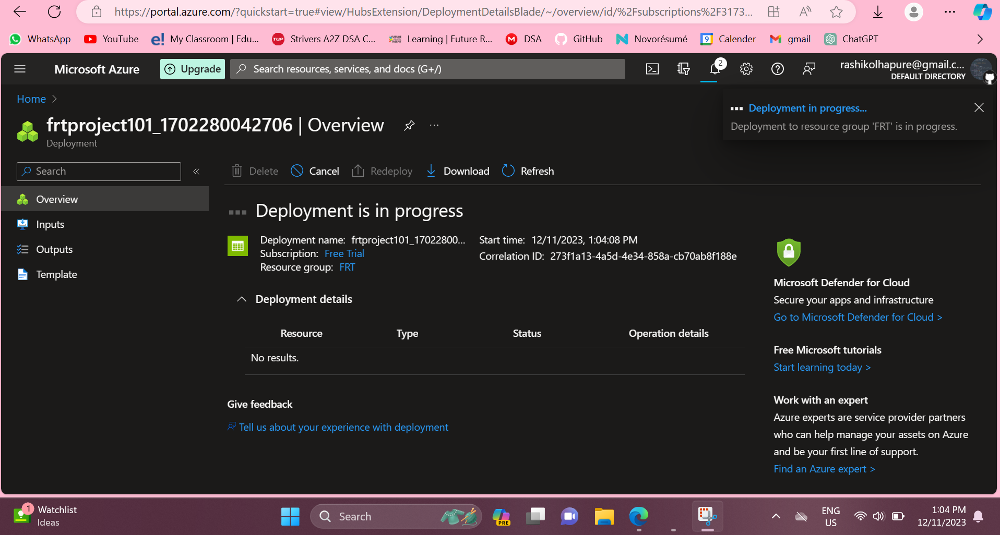
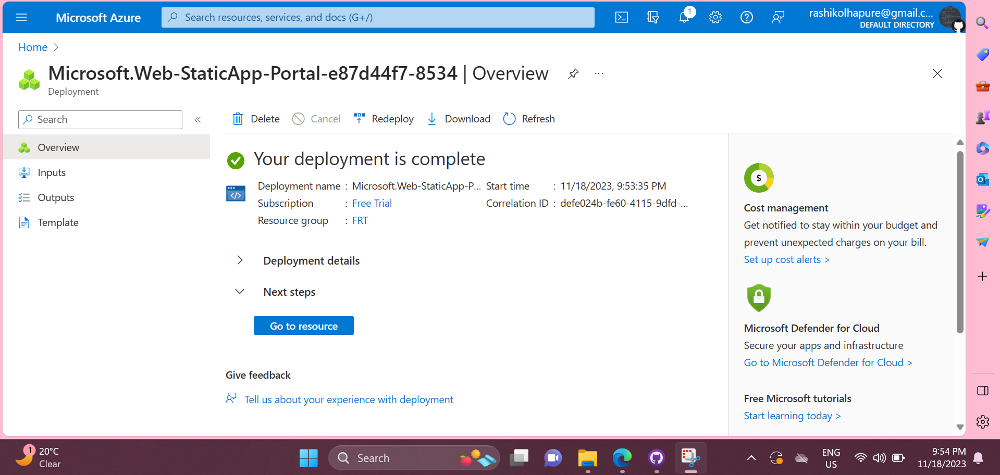
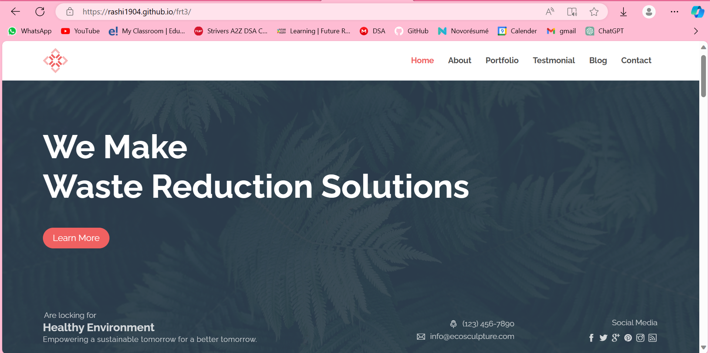
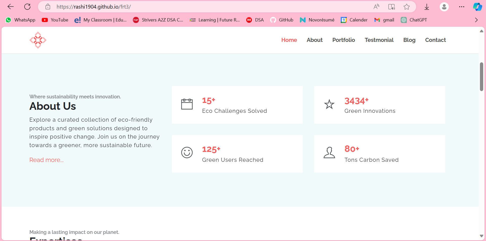
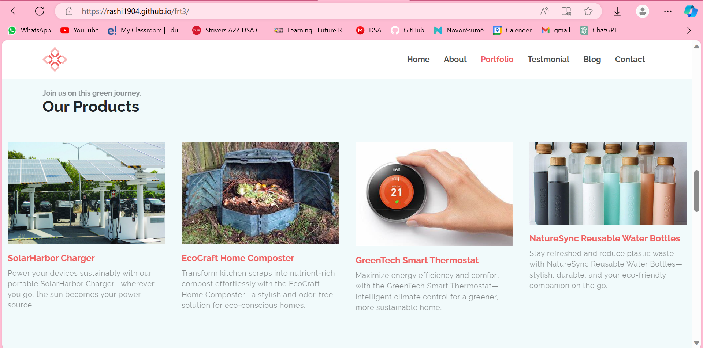
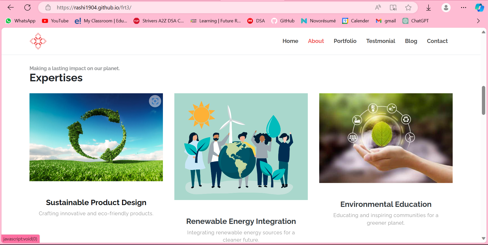
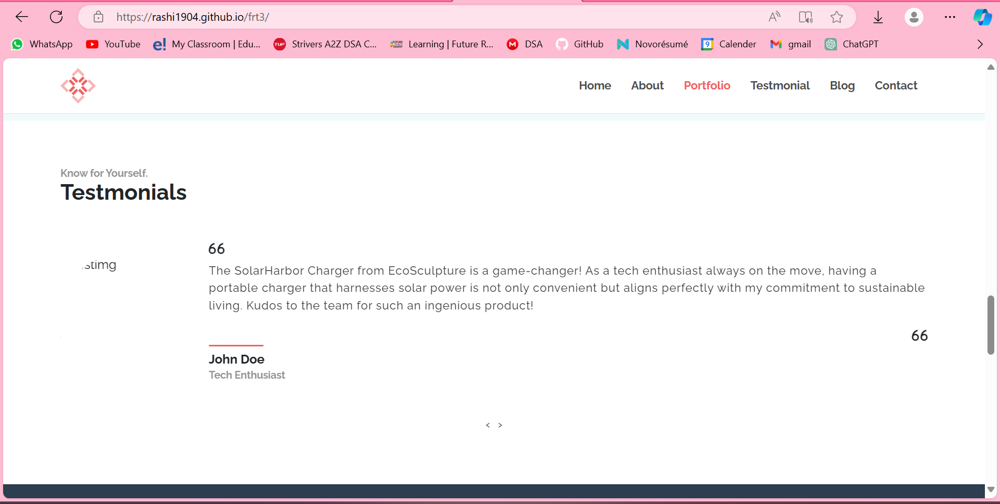
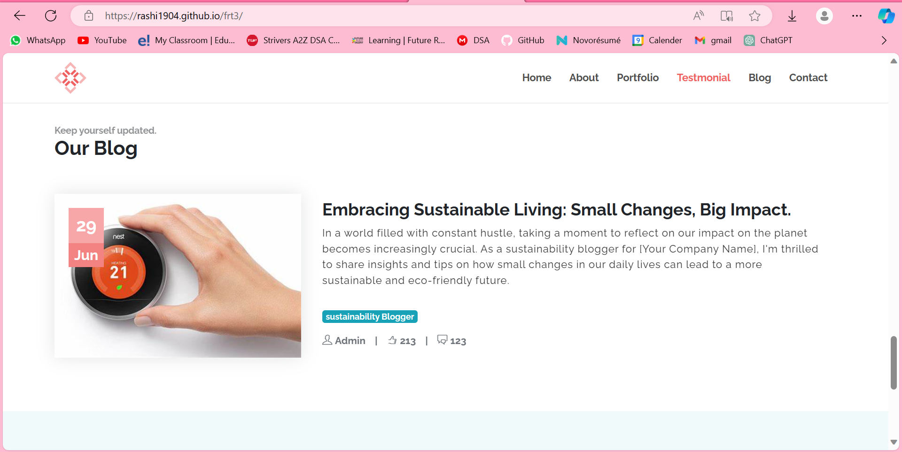
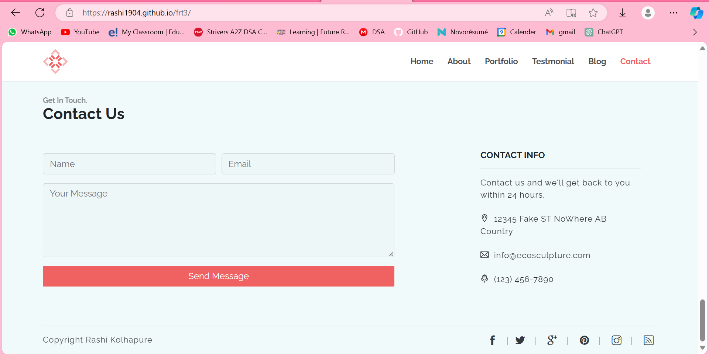

# FRT PROJECT
 EcoSculpture: Future Ready Talent Internship Project
# EcoSculpture Website

## Overview

The EcoSculpture Website is an online platform dedicated to providing a centralized hub for a diverse range of sustainable products. It aims to simplify the adoption of an environmentally friendly lifestyle by offering a user-friendly interface and a curated catalog of eco-conscious goods.

## Key Features

1. **Centralized Hub:**
   - Explore a variety of sustainability-focused products on a single platform.

2. **Comprehensive Catalog:**
   - Curated selection ranging from daily essentials to specialized items.

3. **User-Friendly Interface:**
   - Intuitive design for a seamless and enjoyable shopping experience.

4. **Clear Categorization:**
   - Efficient categorization for quick and easy navigation.

5. **Educational Resources:**
   - Access information and resources on sustainability to make informed choices.

6. **Community Engagement:**
   - Join a community of eco-conscious individuals, share tips, and engage in discussions.

7. **Vendor Collaboration:**
   - Products sourced from vendors committed to sustainable practices.

8. **Responsive Design:**
   - Optimized for various devices to ensure accessibility.

9. **Transparent Practices:**
   - Highlight eco-friendly and ethical aspects of each product.

10. **Feedback Mechanism:**
    - Provide feedback for continuous improvement of the platform.

## Azure Core Services Used

### Azure Blob Storage

Azure Blob Storage is used for secure and scalable storage of product images and other media assets. This ensures efficient handling of multimedia content associated with each product on the EcoSculpture platform.

## Container Deployment Image (For Blob Storage)



### Azure Static Web Apps

Azure Static Web Apps is leveraged for hosting the EcoSculpture Website. This service allows for the deployment of a scalable and globally available static website, ensuring optimal performance for users around the world.
## Hosting Deployment Using Static Web Apps



# Project Demo:
















### Installation
1. Clone the repository.
   ```bash
   git clone https://github.com/rmk1904/frt3.git/
